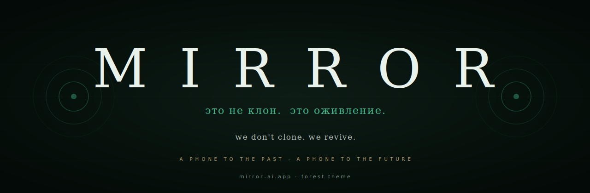
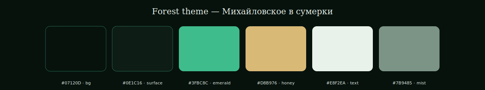
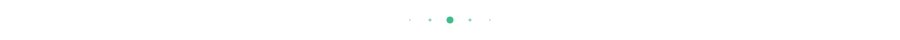

<div align="center">

<picture>
  <source media="(prefers-color-scheme: light)" srcset="./assets/banner-aurora.svg"/>
  
</picture>

# Mirror · Brand Guidelines

</div>

<p align="center">
  <a href="https://github.com/Mirror-Corporation">← Mirror Corporation</a> &nbsp;·&nbsp;
  <a href="https://github.com/Mirror-Corporation/manifesto">Manifesto</a> &nbsp;·&nbsp;
  <a href="https://mirror-ai.app">mirror-ai.app</a>
</p>

<br/>

<div align="center">
<h3><em>«Это не клон. Это оживление.»</em></h3>
<sub>we don't clone. we revive.</sub>
</div>

<br/>

> [!IMPORTANT]
> Every brand choice — wordmark, color, typography, tone — exists to make one sentence true: *"this product takes voices seriously."*
> Mortuary-elegant · anti-Character.AI · quiet over loud · geometry over ornament.

<br/>

---

## I &nbsp; Wordmark

The wordmark is **MIRROR** — all caps, Georgia italic, wide letter-spacing.

| Property | Value |
|---|---|
| Letterform | **Georgia 400 italic** |
| Case | UPPERCASE only |
| Letter-spacing | `0.6em` (very wide) |
| Color | warm white `#E8F2EA` (Forest) or `#FFFFFF` (Aurora) on dark |
| Never on | high-saturation backgrounds, photographs without overlay |

The letter-spacing slows reading. A name you read slowly stays in memory.

<br/>

---

## II &nbsp; Two themes — Aurora & Forest

We **do not** ship light/dark like Apple. We ship two parallel **dark** themes. Same product, two moods.

| | Aurora (default) | Forest (Михайловское) |
|---|---|---|
| Feel | sci-fi cobalt, modern, digital | classical, literary, twilight |
| Reference | Russian cosmism in the year 2036 | Михайловское in dusk, candlelight on parquet |
| Accent | aurora blue `#6EA8FF` | emerald `#3FBC8C` |

> [!NOTE]
> Future themes possible (Sepia, Nocturne, Ember), but **always** as bound-set extensions, never as light/dark toggles.

<br/>

---

## III &nbsp; Palette · Forest theme

<div align="center">

</div>

| Token | Hex | Role |
|---|---|---|
| `--bg` | `#07120D` | night forest floor — deep green-black |
| `--surface` | `#0E1C16` | moss surface — cards |
| `--surface-2` | `#142A20` | deeper moss — inset cards |
| `--text` | `#E8F2EA` | off-white with a green molecule |
| `--muted` | `#7B9485` | forest mist |
| `--emerald` | `#3FBC8C` | **primary accent** — links, active states, wordmark |
| `--gold` | `#D8B976` | warm honey gold — premium accent |
| `--success` | `#34D199` | bright emerald — positive states |
| `--error` | `#E56F5A` | coral — *never* aggressive red |
| `--border` | `rgba(180,220,200,0.08)` | green dust |

<br/>

## IV &nbsp; Palette · Aurora theme

| Token | Hex | Role |
|---|---|---|
| `--bg` | `#0B0B0C` | primary dark background |
| `--surface` | `#1A1A1E` | cards |
| `--surface-2` | `#232328` | deeper card surface |
| `--text` | `#FFFFFF` | pure white text |
| `--muted` | `#9CA3AF` | smoke |
| `--aurora` | `#6EA8FF` | **primary accent** — links, active states |
| `--gold` | `#E8C98A` | premium · quote · skill · achievements |
| `--error` | `#EF4444` | hangup only (Blood-Echo) |
| `--success` | `#10B981` | positive states |

<br/>

---

## V &nbsp; Typography

| Use | Font | Fallback |
|---|---|---|
| Wordmark, titles, quotes, avatar names | **Georgia, italic** | Times New Roman, serif |
| Body, buttons, labels, UI | **Space Grotesk** | -apple-system, system-ui, sans-serif |
| Numbers, durations, years | **JetBrains Mono** | SF Mono, monospace |

> [!IMPORTANT]
> **One serif. One sans. One mono.** No exceptions on official surfaces.
> Why a serif for headlines? Because Mirror is about gravitas — the weight of voices that outlive bodies. Sans-serifs feel like SaaS. Mirror is not SaaS.

<br/>

---

## VI &nbsp; Voice & tone

We write the way our avatars speak: with pauses, with weight, without filler.

| Write | Don't write |
|---|---|
| *"Voices outlive bodies."* | *"AI-powered immersive voice solutions."* |
| *"He answers. He remembers."* | *"Our platform leverages cutting-edge..."* |
| *"This is shipping today."* | *"We are excited to announce..."* |
| Short sentences. | Run-on marketing prose. |
| Specific verbs. | Adjective stacks. |
| *«Это не клон. Это оживление.»* | *"Innovative · revolutionary · disruptive"* (banned) |

> [!WARNING]
> Three words are banned on the corporate site: **innovative · revolutionary · disruptive.** They mean nothing in 2026. If you cannot describe what changes after Mirror without those words, the description is not finished.

<br/>

---

## VII &nbsp; Anti-pattern · what is forbidden

| Forbidden | Why |
|---|---|
| Rainbow gradients | breaks mortuary-elegant tone |
| Pure white text on dark | use warm `#E8F2EA` instead |
| Bright backgrounds | Mirror is always twilight |
| Rotating decoratives | quiet over loud |
| Heavy parallax | distracts from the voice |
| Bouncy springs in motion | feels gamified — except one confirmation toast |
| Aurora/emerald as decoration | it is **only** action accent + active state |
| Gold as background fill | it is **only** premium, quote, skill, achievement |
| Emoji in product copy | mortuary-elegant tone — no 🎉 ever |

<br/>

---

## VIII &nbsp; Imagery

- **Portraits** of historical figures — solemn, frontal, eye-level. Not winking, not theatrical.
- **Buildings** — wide, full, no people. The voice belongs to the space.
- **QR codes** — always brass-plate-mounted; never floating on a phone screen as primary visual.
- **No stock photos of "people on phones"** — ever.

<br/>

---

## IX &nbsp; Pull-quotes

If you have room for one quote, it is this:

> *«Мы не клонируем легенд. Мы возвращаем их к жизни.»*

If you have room for less, it is:

> *«Это не клон. Это оживление.»*

In English:

> *"We don't clone. We revive."*

If you have room for nothing — just the wordmark: **MIRROR**.

<br/>

---

## X &nbsp; Logo & banner assets

Drop-in SVG/PNG assets in [`/assets`](./assets):

| File | Purpose |
|---|---|
| `banner-forest.svg` | 1280×420 hero — Forest theme (primary) |
| `banner-aurora.svg` | 1280×420 hero — Aurora theme |
| `logo-forest.svg` | 512×512 logo (Bond Rings, emerald) |
| `divider-emerald.svg` | section divider |
| `palette-forest.svg` | reference swatches |

More variants by request — write to [aimirror630@gmail.com](mailto:aimirror630@gmail.com).

<br/>

---

## XI &nbsp; Partner badge (coming)

For museums, heritage sites, and brands that deploy Mirror on their objects, we will publish a **"Restored by Mirror"** badge — a small emerald rectangle with the wordmark, intended to sit alongside the QR plate.

```
<a href="https://mirror-ai.app">
  
</a>
```

*Badge image and full guidelines: to be published with the Tarasov-2 site launch (summer 2026).*

<br/>

---

## XII &nbsp; Licensing

The Mirror name, wordmark, and brand assets are © Mirror Corporation 2026.

**You may use these assets without prior permission when:**

- linking to or covering Mirror in editorial press, research, or reviews
- building a Mirror-compatible deployment under a signed partnership
- citing Mirror in academic work

**You may not:**

- imply endorsement Mirror has not given
- modify the wordmark (stretch, recolor outside palette, rotate)
- use the Mirror name on a competing product

Questions: **[aimirror630@gmail.com](mailto:aimirror630@gmail.com)** — we answer within 48h.

<br/>

---

<div align="center">



<br/>

<sub><b>Mirror · Brand Guidelines</b> · version 2 · 2026 · <a href="https://github.com/Mirror-Corporation">Mirror Corporation</a></sub>

</div>
