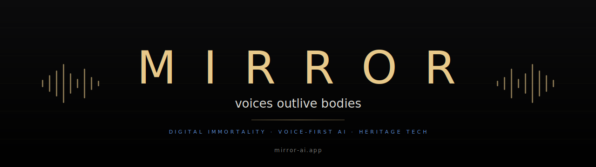
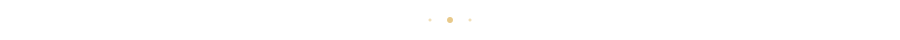

# Mirror · Brand Guidelines

**Public brand guide for partners, press, and contributors.**

 

> The brand carries the philosophy. Every choice — wordmark, color, type, tone — exists to make a single sentence true:
> ***"This product takes voices seriously."***

 

---

## 1. Wordmark

The wordmark is **MIRROR** — all caps, serif, wide letter-spacing.

| Property | Value |
|---|---|
| Letterform | Cormorant Garamond, weight 500 |
| Case | UPPERCASE only |
| Letter spacing | 0.6em (very wide) |
| Color (preferred) | gold `#E8C98A` on dark background |
| Color (alt) | warm white `#F4F4EF` on dark |
| Never on | high-saturation backgrounds, photos without overlay |

Why so wide? The letter-spacing slows reading. A name you read slowly stays in memory.

 

---

## 2. Color palette

| Token | Hex | Role |
|---|---|---|
| **Background** | `#0B0B0C` | primary dark — almost black, slightly warm |
| **Foreground** | `#F4F4EF` | warm off-white — body text, surfaces |
| **Gold accent** | `#E8C98A` | the Mirror highlight — wordmark, accents, premium |
| **Blue accent** | `#6EA8FF` | links, active states, secondary |
| **Pure white** | `#FFFFFF` | gradients only, rare |
| **Soft text** | `rgba(232,230,225,0.9)` | body on dark, warm-paper feel |

### Palette swatches

| | |
|---|---|
|  | `#0B0B0C` background |
|  | `#F4F4EF` foreground |
|  | `#E8C98A` gold (signature) |
|  | `#6EA8FF` blue accent |

> **One rule above all:** if you have to ask whether a color is on-brand, it isn't. Stick to these five.

 

---

## 3. Typography

| Use | Font | Fallback |
|---|---|---|
| Wordmark, titles, quotes, avatar names | **Cormorant Garamond** | Georgia, serif |
| Body, buttons, labels, UI | **Inter** | -apple-system, system-ui, sans-serif |

**One serif. One sans. No exceptions on official surfaces.**

Why a serif for headlines? Because Mirror is about gravitas — the weight of voices that outlive bodies. Sans-serifs feel like SaaS. Mirror is not SaaS.

 

---

## 4. Voice & tone

> We speak the way our avatars speak: with pauses, with weight, without filler.

| Do | Don't |
|---|---|
| "Voices outlive bodies." | "AI-powered immersive voice solutions." |
| "He answers. He remembers." | "Our platform leverages cutting-edge…" |
| "This is shipping today." | "We are excited to announce…" |
| Short sentences. | Run-on marketing prose. |
| Specific verbs. | Adjective stacks. |

**Three banned words on the corporate site:** *innovative · revolutionary · disruptive*. They mean nothing now.

 

---

## 5. Imagery

- **Portraits** of historical figures — solemn, frontal, eye-level. Not winking, not theatrical.
- **Buildings** — wide, full, no people. The voice belongs to the space.
- **QR codes** — always brass, plate-mounted look; never floating on a phone screen as primary visual.
- **No stock photos of "people on phones."** Ever.

 

---

## 6. The pull quote

If you have one quote of room, it is this one:

> *"We don't build chatbots.
> We build people who outlive the body."*

If you have less, it is:

> *"Voices outlive bodies."*

If you have nothing, just the wordmark: **MIRROR**.

 

---

## 7. Logo & banner files

Drop-in SVG/PNG assets in [`/assets`](./assets):

- `banner-corp.svg` — full-width hero banner (1280 × 360)
- `divider-gold.svg` — section divider with gradient
- `mirror-logo.png` — square logo
- More variants on request: write to [aimirror630@gmail.com](mailto:aimirror630@gmail.com)

 

---

## 8. Licensing

The Mirror name, wordmark, and brand assets are © Mirror Corporation 2026.

You may use these assets **without prior permission** when:

- Linking to or covering Mirror in editorial press, research, or reviews
- Building a Mirror-compatible avatar under a signed partnership
- Citing Mirror in academic work

You may **not**:

- Imply endorsement Mirror has not given
- Modify the wordmark (stretch, recolor outside palette, rotate)
- Use the Mirror name on a competing product

Questions? **[aimirror630@gmail.com](mailto:aimirror630@gmail.com)** — we usually answer within 48h.

 

---

 

<b>Mirror · Brand Guidelines</b> · v1 · 2026

